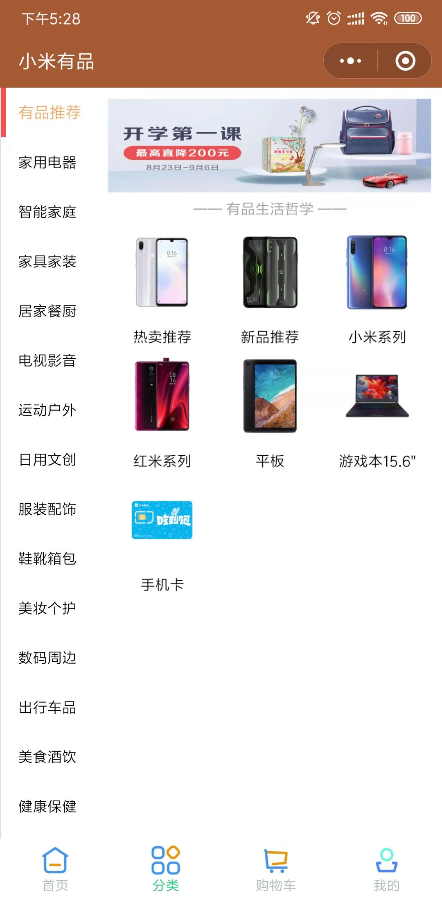
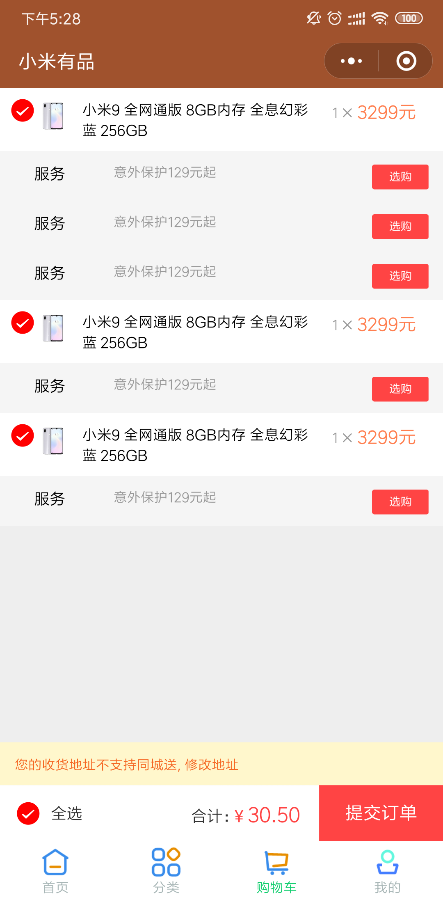
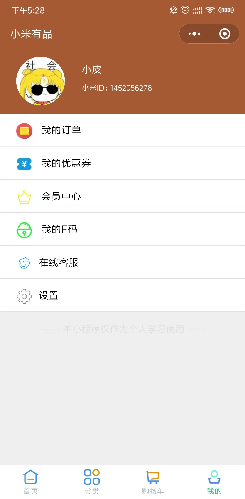
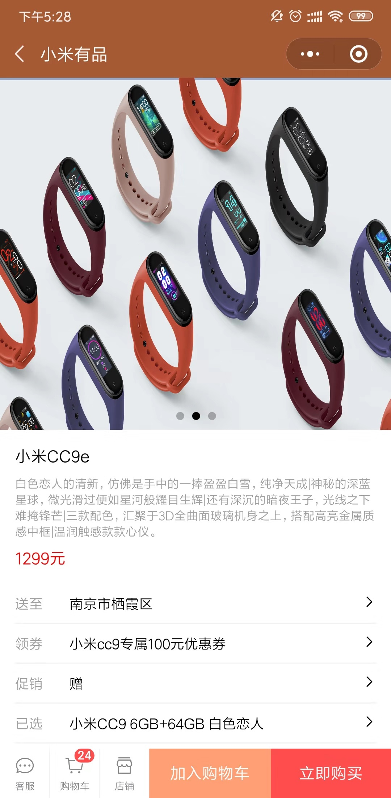
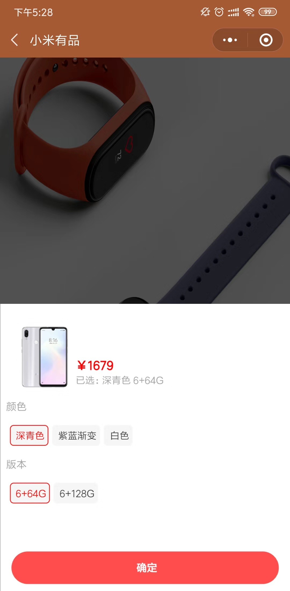

# Millet

微信小程序——仿小米有品

后端接口采用https://api.it120.cc所提供的虚拟接口供自己测试使用

### 目前开发的几个页面

#### 首页

#### 分类

#### 购物车

#### 个人信息

#### 商品详情页

#### 添加到购物车

### 尚待开发的功能

#### 购物车功能完善，全选的实现，以及以前前后端交互功能的完善， 个人信息模块的开发
